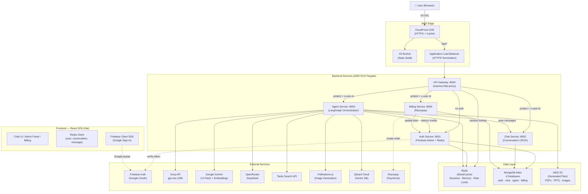
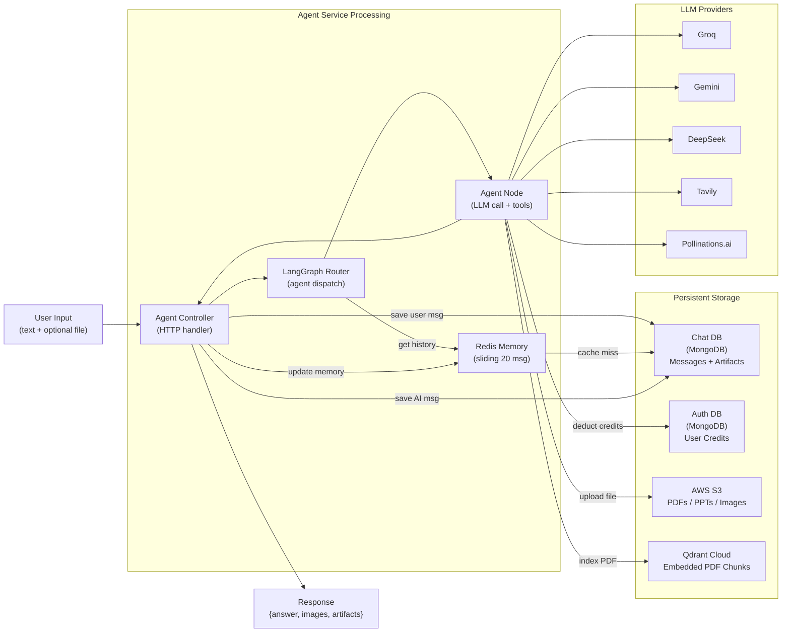
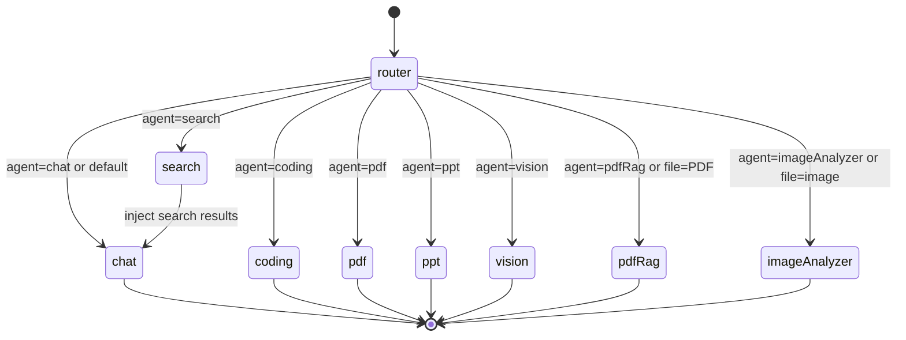
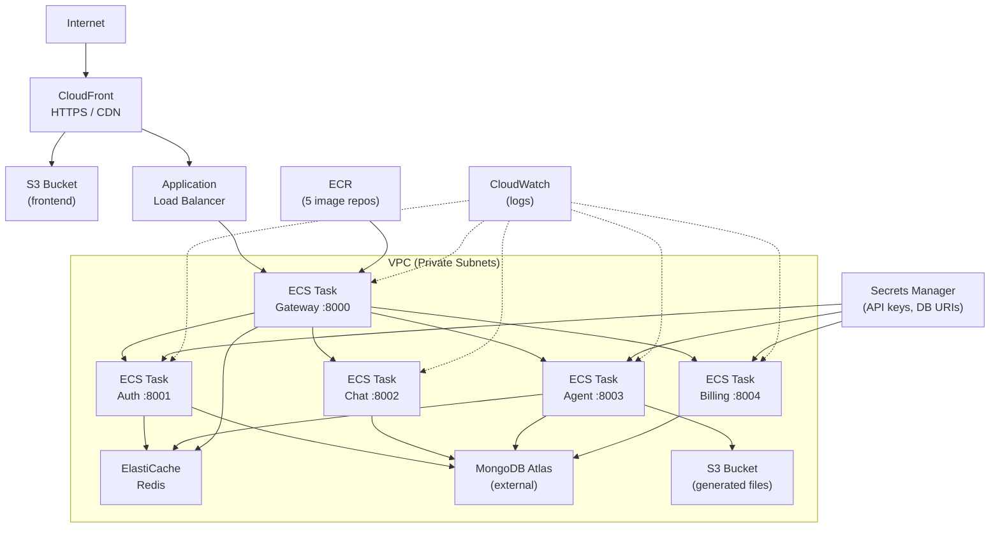
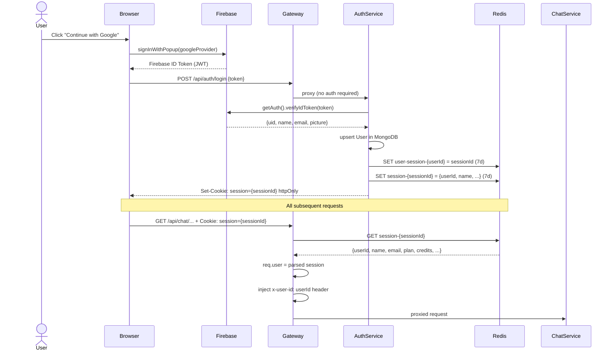
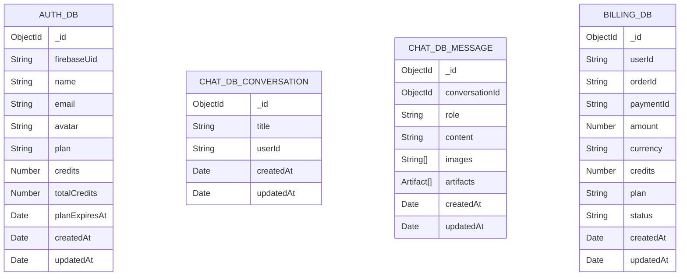
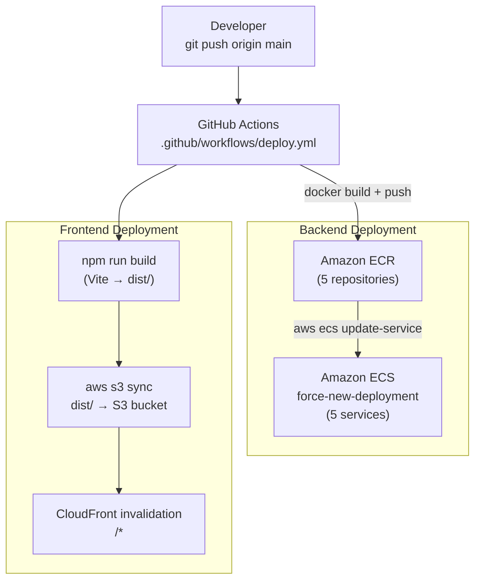

# NovaMind AI — System Architecture

> **Document type:** Technical architecture reference and postmortem  
> **Scope:** Based on complete analysis of all source code, configuration, and deployment files  
> **Notation:** Implemented features are clearly distinguished from recommended future improvements

---

## Table of Contents

1. [Architecture Summary](#1-architecture-summary)
2. [High-Level Architecture](#2-high-level-architecture)
3. [Component Architecture](#3-component-architecture)
4. [End-to-End Request Flow](#4-end-to-end-request-flow)
5. [Data Flow](#5-data-flow)
6. [AI / Agent Architecture](#6-ai--agent-architecture)
7. [AWS Architecture](#7-aws-architecture)
8. [Container Architecture](#8-container-architecture)
9. [Authentication & Security Architecture](#9-authentication--security-architecture)
10. [Database / Storage Architecture](#10-database--storage-architecture)
11. [Observability](#11-observability)
12. [Deployment Architecture](#12-deployment-architecture)
13. [Scalability](#13-scalability)
14. [Reliability & Failure Handling](#14-reliability--failure-handling)
15. [Security Considerations](#15-security-considerations)
16. [Architecture Decisions](#16-architecture-decisions)
17. [Architecture Limitations](#17-architecture-limitations)
18. [Future Architecture](#18-future-architecture)

---

## 1. Architecture Summary

NovaMind AI is a **microservices web application** composed of five independent Node.js/Express backend services, a React single-page application frontend, and an AI orchestration layer built on **LangGraph**. All inter-service communication routes through a central API Gateway. Authentication is session-based using Redis. All services are containerized with Docker and deployed to **AWS ECS Fargate**, with the frontend served via **S3 + CloudFront**.

The AI layer is the architectural centrepiece: rather than a single LLM call, every user message enters a **compiled LangGraph StateGraph** that routes it through one of eight specialized agent nodes. Agents use different LLM providers (Groq, Google Gemini, OpenRouter/DeepSeek), external tools (Tavily search, Pollinations.ai image generation), and storage backends (AWS S3, Qdrant Cloud vector database) depending on the task.

---

## 2. High-Level Architecture



---

## 3. Component Architecture

### 3.1 API Gateway (`backend/gateway/`, port 8000)

**Single public entry point for all API traffic.** Implements:

- **CORS** — restricted to `process.env.FRONTEND_URL` with `credentials: true`
- **Session authentication** (`protect` middleware) — reads `session` cookie → Redis lookup → attaches `req.user`
- **Header injection** (`proxyWithHeader`) — adds `x-user-id: req.user.userId` to all proxied requests
- **Route mapping:**

| Route | Auth | Destination |
|-------|------|-------------|
| `POST /api/auth/*` | None | Auth Service |
| `GET /api/admin/*` | `protect` | Auth Service (admin routes) |
| `* /api/chat/*` | `protect` | Chat Service |
| `POST /api/agent/*` | `protect` | Agent Service |
| `* /api/billing/*` | `protect` | Billing Service |
| `GET /api/me` | `protect` | Gateway (Redis session read) |

### 3.2 Auth Service (`backend/services/auth/`, port 8001)

**Owns all identity, session, credit, and admin operations.**

Responsibilities:
- Firebase ID token verification → user upsert → UUID session creation → Redis storage
- Credit deduction (called by Agent Service after each AI operation)
- Plan update (called by Billing Service after payment verification)
- Admin CRUD: user management, payment history, cross-service stats

Notable: the admin controller opens **separate Mongoose connections** (`createConnection`) to the billing and chat MongoDB instances using `BILLING_MONGODB_URI` and `CHAT_MONGODB_URI`. This allows cross-service data access without HTTP calls for admin analytics.

### 3.3 Chat Service (`backend/services/chat/`, port 8002)

**Pure persistence layer for conversations and messages. Contains no AI logic.**

Stores:
- Conversations (`title`, `userId`) — created on first message, titled after first exchange
- Messages (`conversationId`, `role`, `content`, `images[]`, `artifacts[]`) — append-only history

Notable: `GET /create-conversation` uses GET semantics to create a resource (REST violation).

### 3.4 Agent Service (`backend/services/agent/`, port 8003)

**The AI orchestration layer.** Every incoming request:
1. Saves user message to Chat Service
2. Invokes the LangGraph graph
3. Saves AI response + artifacts to Chat Service
4. Updates Redis conversation memory
5. Returns `{answer, images, artifacts}` to client

Contains: 8 agent implementations, LangGraph graph/router/state, LLM model configs, Redis memory, S3 utilities, PDF/PPT generators, multer file handling.

### 3.5 Billing Service (`backend/services/billing/`, port 8004)

**Razorpay payment lifecycle handler.**

1. Creates Razorpay order + records pending Payment in MongoDB
2. Verifies HMAC-SHA256 payment signature
3. Updates Payment to `paid`
4. Calls Auth Service (`POST /update-plan`) to credit user account

### 3.6 Frontend (`frontend/`, port 5173 dev / CloudFront prod)

React 19 SPA with:
- `BrowserRouter` with two routes: `/` (Home) and `/admin` (AdminRoute-guarded)
- Redux Toolkit for global state (user, conversations, messages/artifacts)
- `withCredentials: true` on all Axios requests (sends session cookie)
- Firebase Client SDK for Google sign-in popup

---

## 4. End-to-End Request Flow

### Standard chat message

```
1.  User types prompt + optionally selects agent pill ("Coding")
2.  ChatInput builds FormData {prompt, conversationId, agent, file?}
3.  sendMessage() → POST /api/agent/chat (multipart/form-data, session cookie)

4.  API Gateway:
    a. cookieParser reads session cookie
    b. protect middleware → redis.get("session-{sessionId}") → attaches req.user
    c. proxyWithHeader adds "x-user-id: {userId}" header
    d. Proxies to Agent Service :8003

5.  Agent Controller:
    a. Extracts {prompt, conversationId, agent, userId} from body/headers
    b. multer disk-stores any uploaded file to ./temp/
    c. POST http://chat:8002/save-message {role:"user", content:prompt}
    d. graph.invoke({prompt, conversationId, agent, userId, file})

6.  LangGraph Execution:
    a. __start__ → router node
    b. router: agent="coding" (explicit) → return state unchanged
    c. coding node:
       - Groq classifies intent → "CODE_GENERATION"
       - checkAgentLimit(userId, "coding") → redis.incr/expire
       - DeepSeek generates {files:[{name,content}]}
       - deductCredits(userId, "coding") → POST http://auth:8001/deduct-credits
    d. coding → __end__
    e. graph returns {aiResponse, artifacts}

7.  Agent Controller (post-graph):
    a. addMessage(conversationId, "user", prompt) → Redis sliding window
    b. addMessage(conversationId, "assistant", result.aiResponse) → Redis
    c. POST http://chat:8002/save-message {role:"assistant", content, artifacts}
    d. return res.json({answer, artifacts})

8.  Frontend receives {answer, artifacts}:
    a. dispatch(addMessage({role:"assistant", content:answer})) → Redux
    b. dispatch(setArtifacts(artifacts)) → Redux
    c. MessageBubble renders Markdown answer
    d. Artifact panel opens with Monaco Editor + iframe live preview
```

### File upload (PDF RAG)

```
1.  User uploads PDF file → ChatInput previews filename
2.  router node: file.mimetype === "application/pdf" → agent = "pdfRag"
3.  pdfRag agent:
    a. fs.readFileSync(file.path) → pdf-parse → text extraction
    b. RecursiveCharacterTextSplitter (1000 chars, 200 overlap)
    c. QdrantVectorStore.fromDocuments(chunks, geminiEmbeddings, {
         url: QDRANT_URL, collectionName: "pdf-{timestamp}"
       })
    d. vectorStore.similaritySearch(prompt, 5) → top chunks
    e. Groq LLM answers from retrieved context only
    f. fs.unlink(file.path) — temp file cleanup
4.  Response: text answer returned directly
```

---

## 5. Data Flow



---

## 6. AI / Agent Architecture

### 6.1 LangGraph StateGraph



**State schema (`graph/state.js`):**
```typescript
{
  prompt:        string       // user input
  aiResponse:    string       // final LLM output
  agent:         string       // resolved agent name
  conversationId: string      // MongoDB conversation ID
  searchResults: string       // Tavily results (for search→chat chain)
  images:        string[]     // presigned S3 URLs or external URLs
  artifacts:     Artifact[]   // code files for coding agent
  userId:        string       // from x-user-id header
  file:          Express.Multer.File  // uploaded file metadata
}
```

### 6.2 Agent Implementation Details

#### Chat Agent
- **Model:** Groq `openai/gpt-oss-120b`
- **Memory:** `getMemory(conversationId)` — Redis cache → Chat Service fallback
- **Context injection:** If `state.searchResults` exists, prepends to system prompt
- **Prompt strategy:** Role-specific instructions for Markdown formatting on technical topics

#### Search Agent (→ Chat pipeline)
- **Tool:** `TavilySearch({maxResults:5, includeImages:true})`
- **Pattern:** Populates `state.searchResults` and `state.images`, then LangGraph edge routes to Chat Agent for grounded synthesis
- **Why separate nodes:** Keeps search tool logic isolated; Chat Agent handles natural language synthesis regardless of source

#### Coding Agent
- **Two-phase execution:**
  1. **Intent classification** (Groq) → one of: `CODE_GENERATION | CODE_REVIEW | CODE_EXPLANATION | DEBUGGING | OPTIMIZATION | CONVERSION | DOCUMENTATION`
  2. **Specialized execution** — `CODE_GENERATION` calls DeepSeek for `{files:[]}` JSON; all others call Groq for Markdown analysis
- **CODE_GENERATION output:** Multi-file project `{files:[{name,content}]}`. Defaults to HTML/CSS/JS; adapts to React/Vue/Next if requested. Uses real `unsplash.com` image URLs.
- **Artifacts:** Returned as `[{id, type, title, files:[]}]` — rendered in Monaco Editor + iframe preview

#### PDF Generator
- **Prompt:** Groq returns `{title, subtitle, sections:[{heading, points:[]}]}` as JSON
- **Generation:** PDFKit on Node.js — A4 size, title/subtitle centered, sections with bullet points, footer "Generated By CortexAI"
- **Storage:** `PutObjectCommand` → S3, then `GetObjectCommand` presigned URL (24-minute expiry)

#### PDF RAG Agent
- **Pipeline:** pdf-parse → `RecursiveCharacterTextSplitter(1000, 200)` → Qdrant collection `pdf-{timestamp}` → Gemini Embedding 001 → similarity search (k=5) → Groq answers from context
- **Constraint:** System prompt strictly limits Groq to answering only from retrieved chunks
- **Known issue:** Qdrant collections are created but never deleted

#### PPT Generator
- **Prompt:** Groq returns `{title, subtitle, slides:[{title, points:[]}]}` — exactly 6 content slides
- **Generation:** PptxGenJS — LAYOUT_WIDE format, cover slide with blue gradient, content slides with alternating row colors, bullet ellipses, thank-you slide
- **Storage:** S3, presigned URL with 24-hour expiry

#### Vision Agent (Image Generation)
- **Prompt engineering:** Groq converts user query into detailed cinematic prompt
- **Generation:** `https://image.pollinations.ai/prompt/{encodedPrompt}` — free external API, no key required
- **Storage:** Downloads image buffer → S3 → presigned URL

#### Image Analyzer Agent
- **Model:** Gemini 2.5 Flash (multimodal)
- **Input:** Reads uploaded file → base64 data URL → `{type:"image_url", image_url:{url:dataUrl}}` in HumanMessage content block
- **Output:** Text analysis, chart/table extraction, question answering
- **Cleanup:** `fs.unlink(file.path)` in `finally` block

### 6.3 Rate Limiting (Redis INCR pattern)

```javascript
key = `rate:${userId}:${agent}`
count = await redis.incr(key)
if (count === 1) redis.expire(key, 60)   // start 60s window
if (count > limit) throw 429 error
```

Limits: `chat:20/min`, all others: `5/min`

### 6.4 Conversation Memory (Redis sliding window)

```javascript
// Read: Redis cache hit → return. Miss → fetch from Chat Service → cache 24h
getMemory(conversationId)

// Write: append → trim to 20 → save (no TTL reset)
addMessage(conversationId, role, content)
```

The last 20 messages are injected as `BaseMessage[]` into the Chat agent's LLM call.

---

## 7. AWS Architecture



### AWS Service Responsibilities

| Service | Component | Responsibility |
|---------|-----------|---------------|
| **ECS Fargate** | All 5 services | Serverless container execution — no EC2 management |
| **ECR** | 5 repositories | Docker image registry (`novamind-gateway`, `novamind-auth`, etc.) |
| **S3** (app) | Agent Service | Stores generated PDFs, PPTs, AI images; objects accessed via presigned URLs |
| **S3** (frontend) | React build | Hosts `dist/` folder; serves via CloudFront origin |
| **CloudFront** | Frontend | HTTPS termination, global CDN, custom error pages for SPA routing (403/404 → index.html) |
| **ALB** | Gateway | HTTPS termination for API, health checks, routes to ECS gateway task |
| **ElastiCache** | Redis | Sessions (7d TTL), conversation memory (24h TTL), rate limiting (60s TTL) |
| **Secrets Manager** | All services | API keys, DB URIs, Firebase service account JSON (injected at container startup) |
| **CloudWatch Logs** | All services | Container stdout/stderr via `awslogs` log driver |
| **VPC** | All services | Private networking; ECS tasks in private subnets, ALB in public subnets |
| **NAT Gateway** | Private subnets | Outbound internet for ECS tasks (to reach Groq, Atlas, etc.) |

---

## 8. Container Architecture

### Dockerfile Pattern (identical across all 5 services)

```dockerfile
FROM node                        # ⚠ unpinned — should be node:22-alpine
WORKDIR /app
COPY package*.json ./            # root backend workspace package.json
RUN npm install                  # installs ioredis (shared dependency)
COPY ./gateway/package*.json ./gateway/   # service-specific packages
RUN cd gateway && npm install
COPY gateway ./gateway           # service source code
COPY shared ./shared             # shared/redis/redis.js
WORKDIR /app/gateway
EXPOSE 8000
CMD ["npm", "start"]             # runs "node index.js"
```

### Build Context

All Dockerfiles use `backend/` as the Docker build context (not the service directory). This allows the `COPY shared ./shared` instruction to include the shared Redis client.

### Container-to-Container Communication

In production (ECS), services communicate via **AWS Cloud Map service discovery DNS**:
- `novamind-auth.novamind.local:8001`
- `novamind-chat.novamind.local:8002`
- etc.

In local development, `localhost` is used since all processes run on the same machine.

### Port Mapping

| Service | Container Port | External Exposure |
|---------|---------------|------------------|
| Gateway | 8000 | ALB → public internet |
| Auth | 8001 | Gateway only (private) |
| Chat | 8002 | Gateway only (private) |
| Agent | 8003 | Gateway only (private) |
| Billing | 8004 | Gateway only (private) |
| Redis | 6379 | ECS tasks only (private) |

### Local Development (`docker-compose.yml`)

Only Redis is containerized locally. Services run as bare Node.js processes:

```yaml
services:
  redis:
    image: redis
    ports:
      - 6379:6379
```

---

## 9. Authentication & Security Architecture



### Session Lifecycle
- **Creation:** UUID v4 generated server-side on login
- **TTL:** 7 days for both `user-session-*` and `session-*` keys
- **Invalidation:** `redis.del("session-{sessionId}")` on logout
- **Refresh:** Auth service updates `session-{sessionId}` whenever plan or credits change, so the next request sees fresh data without re-login

### Admin Authorization
```
Request → protect (session check) → proxyWithHeader → Auth Service
         → adminProtect (email === ADMIN_EMAIL) → handler
```

---

## 10. Database / Storage Architecture

### MongoDB Atlas — 4 Separate Databases



Each service owns its own database:
- `auth` — User accounts (or `test` DB — depends on URI format)
- `chat` — Conversations and messages
- `billing` — Payment records
- `agent` — (No agent-specific models currently; MongoDB connection is present but unused directly)

**Cross-service data access:** Admin controller connects directly to billing and chat databases using `mongoose.createConnection(BILLING_MONGODB_URI)` and `mongoose.createConnection(CHAT_MONGODB_URI)`. Connections are singleton-cached per process.

### AWS S3 — Generated File Storage

```
Bucket: cretexainovamind (ap-south-1)
├── pdf-{timestamp}.pdf          ← PDF Generator agent
├── ppt-{timestamp}.pptx         ← PPT Generator agent
└── {Date.now}-{originalname}    ← Vision agent (AI images)
     (note: Date.now bug produces broken filenames)
```

Access pattern: write-once, read-via-presigned-URL.

| File Type | Presigned URL Expiry | User-Facing Message |
|-----------|---------------------|---------------------|
| PDF | 24 minutes (24 × 60 = 1440s) | "10 minutes" ← incorrect |
| PPT | 24 hours (24 × 60 × 60 = 86400s) | "10 minutes" ← incorrect |
| Vision image | 24 minutes (24 × 60 = 1440s) | "10 minutes" ← incorrect |

### Redis — Session & Memory Store

```
Keys:
  session-{uuid}           → JSON user object           TTL: 7 days
  user-session-{userId}    → sessionId string           TTL: 7 days
  messages-{convId}        → JSON messages array        TTL: 24 hours
  rate:{userId}:{agent}    → request count integer      TTL: 60 seconds
```

### Qdrant Cloud — Vector Database

Used exclusively by the PDF RAG agent.

```
Collection: pdf-{timestamp}
Vectors: Gemini Embedding 001 (dimension: auto)
Distance: Cosine (Qdrant default)
Metadata: {pageContent: string, ...}
Lifecycle: Never deleted ← known issue
```

---

## 11. Observability

### Implemented

**Logging — `morgan` (Gateway):**
- HTTP access logs in `dev` format to stdout on the gateway only
- Format: `METHOD /path HTTP/1.1 STATUS bytes - ms`

**console.log / console.error:**
- All services use `console.log` for debugging (DB connection status, session IDs, errors)
- No structured logging format — plain string concatenation

**AWS CloudWatch:**
- ECS containers emit all stdout/stderr to CloudWatch via `awslogs` log driver
- Log groups: `/ecs/novamind-{service}`
- Stream prefix: service name

**Error propagation:**
- Gateway has error-handling middleware: logs error, returns `{message}` with status if `err.status` is set
- Agent rate limiting throws structured errors with `status:429` and `data.message`

### Not Implemented
- Distributed tracing (e.g., OpenTelemetry, AWS X-Ray)
- Metrics collection (e.g., Prometheus, CloudWatch custom metrics)
- Health check endpoints on any service
- Alerting / PagerDuty integration
- Log aggregation or search (e.g., CloudWatch Insights queries)
- Request IDs for log correlation across services

---

## 12. Deployment Architecture



### GitHub Actions Pipeline (`.github/workflows/deploy.yml`)

**Trigger:** `push` to `main` branch

**Job 1: `deploy-backend`**
```
1. Checkout code
2. Configure AWS credentials (from GitHub Secrets)
3. Login to ECR
4. For each service (gateway, auth, chat, agent, billing):
   docker build -f backend/{service}/Dockerfile -t {ECR_URI}/{service}:latest backend/
   docker push {ECR_URI}/{service}:latest
5. For each service:
   aws ecs update-service --cluster {CLUSTER} --service {SERVICE} --force-new-deployment
```

**Job 2: `deploy-frontend`** (depends on: `deploy-backend`)
```
1. npm install
2. npm run build (Vite, reads VITE_* env vars from GitHub Secrets)
3. aws s3 sync frontend/dist s3://{S3_BUCKET} --delete
4. aws cloudfront create-invalidation --paths "/*"
```

**Required GitHub Secrets:**
`AWS_REGION`, `AWS_ACCOUNT_ID`, `AWS_ACCESS_KEY`, `AWS_SECRET_ACCESS_KEY`, `ECS_CLUSTER`, `GATEWAY_SERVICE`, `AUTH_SERVICE_NAME`, `CHAT_SERVICE_NAME`, `AGENT_SERVICE_NAME`, `BILLING_SERVICE_NAME`, `S3_BUCKET`, `CLOUDFRONT_DISTRIBUTION_ID` + all `VITE_*` frontend env vars

---

## 13. Scalability

### Current Architecture

**Can scale:**
- ECS Fargate tasks can scale horizontally by increasing `desiredCount` — each service is stateless (state lives in Redis and MongoDB)
- Redis session store allows multiple Gateway replicas to share sessions
- MongoDB Atlas scales independently
- S3 and CloudFront are inherently scalable

**Cannot scale without changes:**
- **Agent Service is the bottleneck** — LLM calls are synchronous and blocking. A single slow LangGraph execution (e.g., 30-second PPT generation) holds one task thread. Under high concurrency, the Agent Service will become a bottleneck.
- **No horizontal Redis sharding** — single ElastiCache node. Acceptable for current scale.
- **No async/queue-based processing** — agent requests are synchronous HTTP with no timeout protection

### Throughput Estimates (current architecture)
- Rate limits cap individual users at 5–20 requests/minute per agent
- No global throughput cap configured — depends on ECS task count and LLM provider rate limits

---

## 14. Reliability & Failure Handling

### Implemented

| Mechanism | Location | Notes |
|-----------|----------|-------|
| Try/catch on all controllers | All services | Returns `{message}` JSON on error |
| Agent rate limiting | Redis INCR | Per-user per-agent, 60s window |
| Credit pre-check | Auth controller | Checks before deducting |
| Temp file cleanup | pdfRag + imageAnalyzer | `fs.unlink` in `finally` block |
| Session TTL | Redis | Auto-expiry after 7 days |

### Failure Scenarios

| Failure | Current Behaviour | Gap |
|---------|------------------|-----|
| Groq API timeout | Request hangs until Node.js timeout | No timeout configured on LLM calls |
| Redis down | All authenticated requests fail (gateway protect returns 500) | No Redis fallback |
| MongoDB Atlas connection refused | Service startup succeeds; first DB query throws; service returns 500 | No retry logic |
| Agent graph throws mid-execution | User message already persisted in Chat DB; no AI response | Orphaned message |
| S3 upload fails | Caught by try/catch; returns "failed to generate {type}" | Error logged; no retry |
| Qdrant unreachable | PDF RAG fails; other agents unaffected | No retry |
| Firebase Admin token verification fails | Login returns 500 | No error differentiation for expired vs invalid tokens |

### No Retries
No retry logic is implemented anywhere in the codebase. All external API calls (Groq, Gemini, Tavily, S3, Qdrant, Razorpay) are single-attempt.

---

## 15. Security Considerations

### Implemented Controls

| Control | Mechanism |
|---------|-----------|
| Session security | httpOnly, 7-day TTL, server-side invalidation |
| CORS | Single-origin restriction in gateway |
| Razorpay signature verification | HMAC-SHA256 on payment webhook |
| Admin access control | Email-based guard in middleware + frontend route |
| Firebase token verification | firebase-admin `verifyIdToken` — verifies Google signature |
| Credit pre-validation | Credits checked before any billable operation |
| Rate limiting | Redis-based per-user per-agent |
| Secrets at rest | AWS Secrets Manager in production |

### Security Gaps

| Gap | Risk | Recommendation |
|-----|------|---------------|
| `cookie.secure = false` | Session cookie sent over HTTP | Set `secure: process.env.NODE_ENV === "production"` |
| `sameSite: "strict"` | Cross-domain cookie blocked | Use `"none"` with `secure:true` for cross-subdomain prod |
| Internal service-to-service calls unauthenticated | Agent/Billing can call Auth `/deduct-credits` or `/update-plan` without a secret | Add internal API key or network-level isolation (security group rules in VPC) |
| No `/api/auth/login` rate limiting | Brute-force Firebase token replay | Add IP-based rate limiting at gateway |
| No message ownership check | Any authenticated user can call `GET /chat/get-messages/:id` | Add `userId` filter in Chat service |
| Dockerfile FROM unpinned | Reproducibility risk | Pin to `FROM node:22-alpine` |

---

## 16. Architecture Decisions

### Decision 1: Session-based auth over JWT

**Implemented:** UUID session stored in Redis. Gateway validates in one O(1) Redis read.

**Why it makes sense here:** Sessions can be immediately invalidated on logout, plan change, or credit depletion — the Redis session blob is refreshed in-place. With JWT, you'd need a blacklist or short expiry + refresh token complexity. For a monolithic-ish gateway pattern, Redis sessions are simpler and faster.

**Trade-off:** Redis is now a hard dependency — if it goes down, all authenticated requests fail.

---

### Decision 2: LangGraph for agent orchestration

**Implemented:** `StateGraph` with 9 nodes, conditional edges, compiled to a reusable `graph` instance.

**Why it makes sense here:** LangGraph provides typed state sharing between nodes, clean conditional routing, and the ability to chain agents (search → chat). The alternative — a series of if/else blocks in a single function — would be harder to extend and test. LangGraph's graph topology is the single source of truth for control flow.

**Trade-off:** Adds significant dependency weight (`@langchain/langgraph`, `@langchain/core`, etc.). For simple use cases this overhead is not justified, but for 8 agents with chaining it pays off.

---

### Decision 3: Multi-provider LLM strategy

**Implemented:** Groq for speed, DeepSeek for code quality, Gemini for multimodal tasks.

**Why it makes sense here:** No single provider excels at everything. Groq's low-latency API makes routing fast. DeepSeek's code benchmarks justify the OpenRouter hop for coding. Gemini's native multimodal support handles image analysis without base64 workarounds.

**Trade-off:** 3 API keys, 3 billing accounts, 3 failure modes.

---

### Decision 4: Header injection for user identity

**Implemented:** `proxyWithHeader` injects `x-user-id` from the validated session into every proxied request.

**Why it makes sense here:** Downstream services don't need Redis access or JWT parsing — they simply read a header. The security model relies entirely on the gateway being the only publicly accessible entry point. In a VPC with proper security groups, downstream services cannot be reached directly.

**Trade-off:** Internal services trust the header implicitly. If the gateway is bypassed (e.g., a mis-configured security group), any caller can impersonate any user.

---

### Decision 5: Separate MongoDB databases per service

**Implemented:** Each service has its own `MONGODB_URI` pointing to a different named database on the same Atlas cluster.

**Why it makes sense here:** Enforces service data isolation at the database level. The billing service cannot accidentally query user data. Schema migrations in one service don't affect others.

**Trade-off:** Admin cross-service queries require separate Mongoose connections. Currently handled by `createConnection()` in the admin controller — functional but not elegant.

---

## 17. Architecture Limitations

| Limitation | Description | Severity |
|-----------|-------------|----------|
| Synchronous LLM calls | Agent service blocks per request. PPT/PDF/RAG can take 30–60 seconds. | High |
| No streaming | Users wait for complete response before anything renders | Medium |
| Multer filename bug | `Date.now` not invoked — filenames are `"function now() { [native code] }-file.ext"` | Medium |
| Qdrant collection leak | Each PDF RAG call creates an uncleaned Qdrant collection | Medium |
| Presigned URL expiry mismatch | Code and UI disagree on expiry times | Low |
| No retry logic | All external API calls are single-attempt | Medium |
| Agent message pre-saved | User message persisted before graph execution; orphaned on graph failure | Low |
| Cookie security gap | `secure:false` unsuitable for HTTPS production | High |
| No tests | No automated test suite | High |
| Unpinned base Docker image | `FROM node` — non-reproducible builds | Low |
| Internal service auth | No authentication on inter-service calls (network-level trust only) | Medium |

---

## 18. Future Architecture

> **All items below are proposed future improvements. None are currently implemented.**

### Near-term (Production Readiness)

```
┌──────────────────────────────────────────────┐
│         Proposed Production Additions         │
│                                               │
│  ✦ Fix cookie.secure = true                  │
│  ✦ Add internal service API key              │
│  ✦ Pin Dockerfile base images                │
│  ✦ Add health check endpoints                │
│  ✦ Add Qdrant collection TTL/cleanup         │
│  ✦ Add login rate limiting                   │
│  ✦ Add message ownership validation          │
│  ✦ Add automated tests (Vitest + Node test)  │
└──────────────────────────────────────────────┘
```

### Medium-term (UX & Performance)

**Streaming responses:**
```
Agent Service → Server-Sent Events → Gateway → Frontend
(stream LLM tokens as they arrive instead of waiting for full response)
```

**Async job queue for long tasks:**
```
Agent Controller → SQS Queue → Worker (ECS)
Frontend polls job status → GET /api/agent/status/{jobId}
Eliminates HTTP timeout for PPT/PDF generation
```

**Qdrant per-user namespace:**
```
Collection naming: pdf-{userId}-{timestamp}
Enables cross-session PDF memory ("ask questions about your documents")
```

### Long-term (Scale)

**Proposed evolved architecture:**
```
CloudFront → ALB → API Gateway
                       │
        ┌──────────────┼──────────────┐
        │              │              │
  Auth Service    Chat Service   Agent Service
  (stateless)    (stateless)     │
                                 ├── SQS (async jobs)
                                 ├── Workers (Fargate)
                                 └── Result cache (ElastiCache)

Shared:
  ├── OpenTelemetry → AWS X-Ray (distributed tracing)
  ├── Pino structured logging → CloudWatch Insights
  ├── Custom CloudWatch metrics → alarms
  └── Secrets Manager rotation automation
```

**Why not now:** Current user scale doesn't justify the operational complexity. The synchronous architecture is simpler to develop, debug, and operate for a single-developer project.

---

*Architecture document based on complete analysis of all source files in `E:\GenAi-Project-Cloudage\1.cortexAI`*  
*Built by [Aamir](https://github.com/aamir490)*
